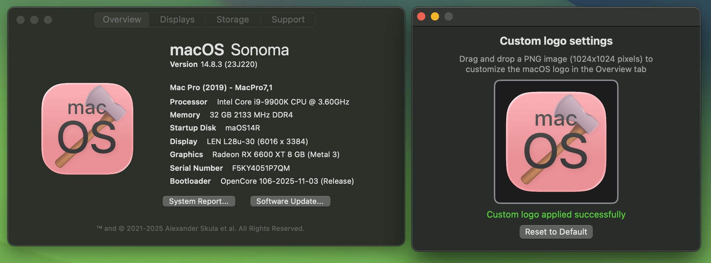
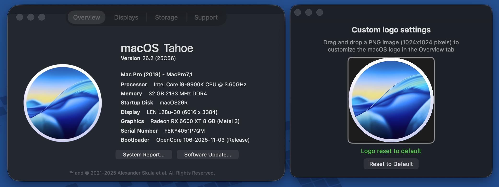
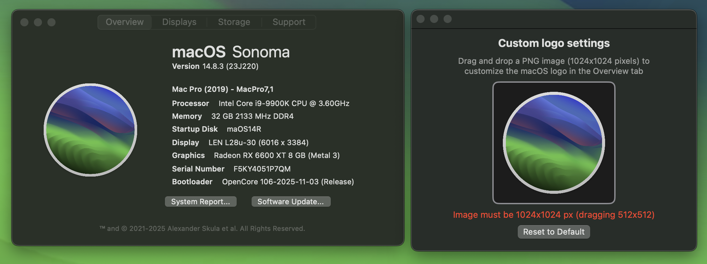

# Customization

### Custom Logo

Want to personalize your About This Hack? You can now replace the macOS logo in the Overview tab with your own custom image!

1. Go to **About This Hack > Preferences...** (or press ⌘,)
2. Drag and drop your custom PNG image (must be 1024x1024 pixels)
3. Your custom logo will instantly appear in the Overview tab
4. Click "Reset to Default" anytime to restore the original macOS logo

**Note:** The image must be in PNG format and exactly 1024x1024 pixels in size.

## Implementation

**New Components**

- `SettingsWindowController.swift` - Manages settings UI with drag-and-drop validation
- `Settings.storyboard` - Settings window layout with logo preview and reset functionality
- `CustomLogoConstants.swift` - Shared constants for logo path key and notification name

**Modified Components**

- `ViewController.swift` - Checks UserDefaults for custom logo before displaying default OS image
- `AppDelegate.swift` - Instantiates and shows Settings window
- `Main.storyboard` - Connected Preferences menu item to showSettings action

**Localization**

- Added strings for EN, ES, FR in respective `Localizable.strings` files

## Behavior

Custom logo path persists in UserDefaults. Overview tab updates via notification when logo changes or resets. Image validation enforces PNG format and exact 1024x1024 dimensions with user feedback.

## Custom logo screenshots

## Default logo screenshots

## Errors screenshots

