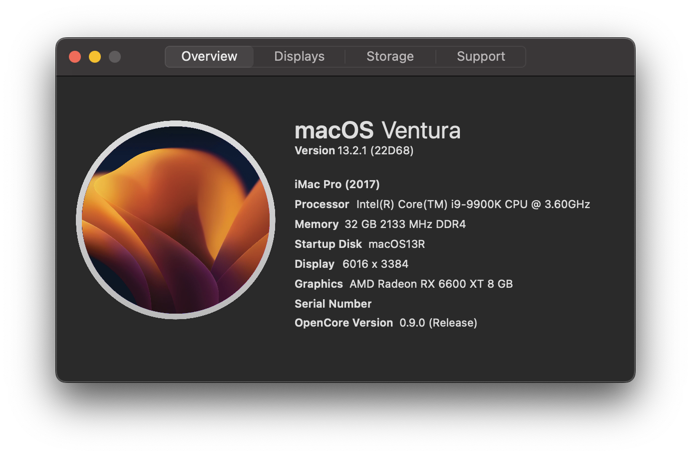
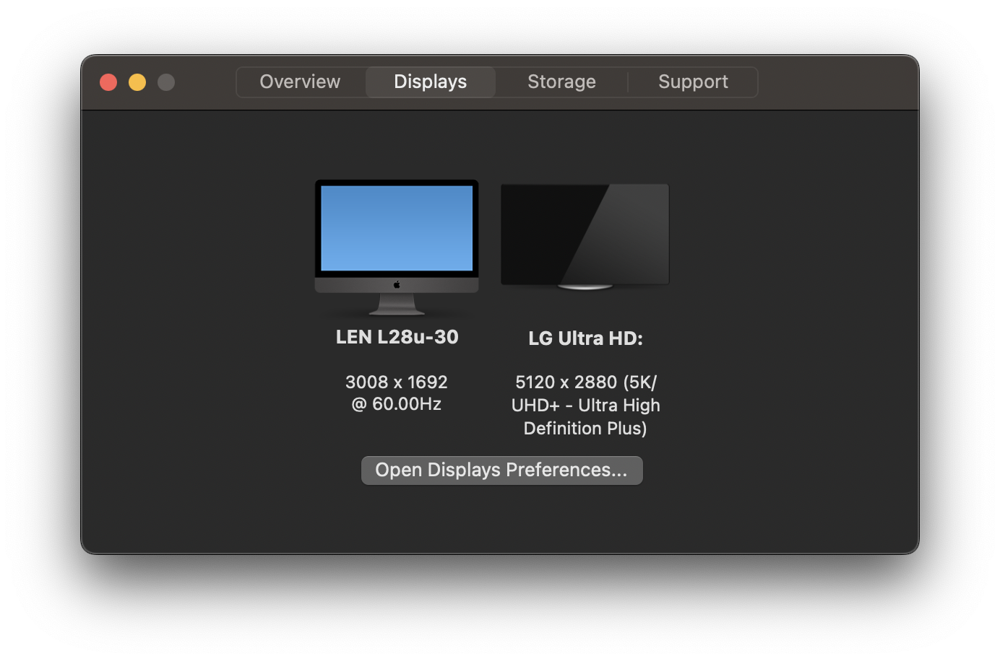
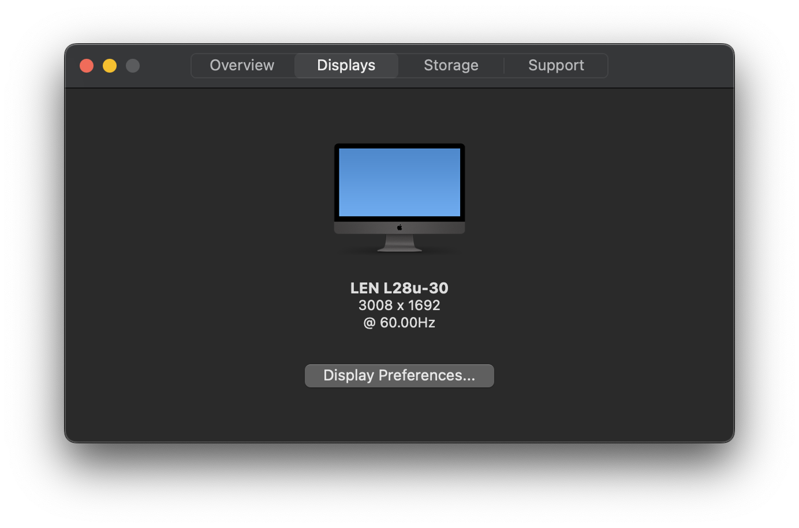

# About This Hack
A simple application to view your exact hardware on macOS. Similar to About This Mac, but with more features, including AMD Processor Support, display resolution, and more! It retains the old "About This Mac" design language and is supported on both Hackintoshes and real Macs. 

# Supported OS's
- **10.11 El Capitan and newer**
- Not supported in any way in Linux or Windows

# How To Install
1) Download the zip file from the [latest release](https://github.com/0xCUB3/About-This-Hack/releases/latest)
2) Drag the enclosed app to your Applications Folder
3) Open it!
4) If you get [this error](https://user-images.githubusercontent.com/79278890/111886978-4af4cb80-89a8-11eb-90c8-522a89abb48e.png) when opening:
- Open `System Preferences` and go to `Security & Privacy`.
- Under `General` you should see [this prompt](https://user-images.githubusercontent.com/79278890/111887197-c6a34800-89a9-11eb-83e2-9fd3d61e2c15.png):
- Click "Open Anyway"

# Overview of Features

In the app, there are four tabs on a tab bar at the top of the window, and each one visually presents some information about your system.

The Overview tab presents standard system specifications, such as computer model, OS, processor, etc. The app also shows the Clover or OpenCore bootloader version, if applicable.

The Displays tab presents your monitors and internal displays. Up to 3 displays with their respective resolutions can be shown.

Or with only one display:

The Storage tab presents your startup disk with its name, free and total storage, and a bar to indicate the amount used.

The Support tab contains numerous links to provide support with your Mac or Hackintosh. Note that the Mac links point to Apple's website, and the Hackintosh ones point to Dortania's guide.

# Credits
[MDNich](https://github.com/MDNich) for helping out a ton with features, code, and setting up the update server.  
[LordNaut](https://github.com/Nautilus704) for helping me fix stuff with AppDelegate and sorting out a bunch of minor, but important features!  
[Ben216k](https://github.com/Ben216k) for being awesome, providing some of the commands, and helping me debug a lot.  
[Snoopy](https://macosicons.com/#/u/Squid4572) for helping create the new icon.  
The internet for helping me with a lot of the code.

# Contact
You can reach me at the following destinations:  
Discord - 0xCUBE#9118  
Reddit - [u/0xCUBE](https://www.reddit.com/user/0xCUBE)

## Star History

