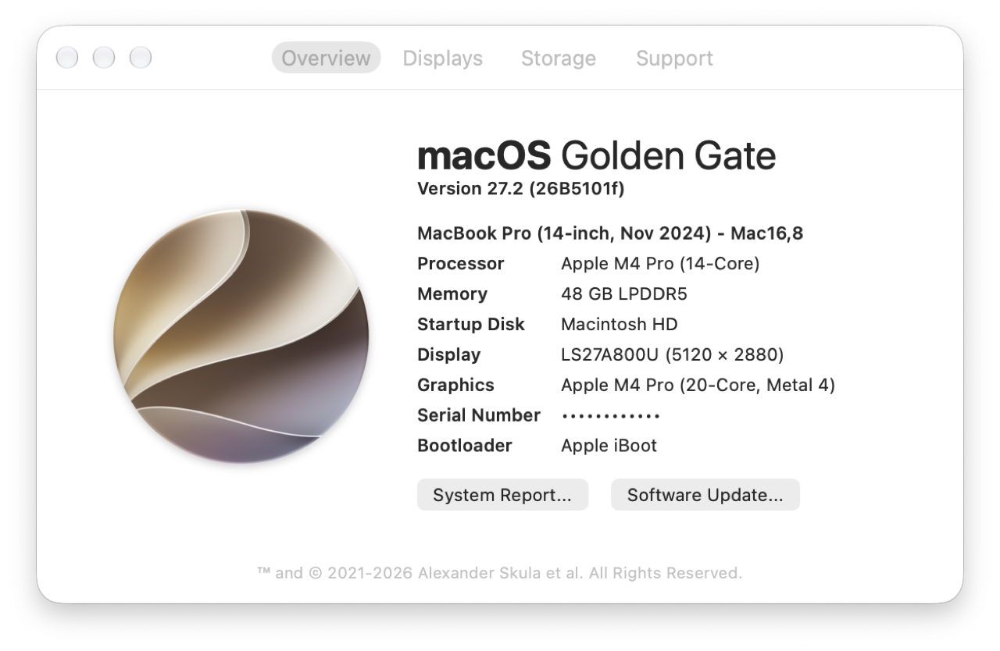
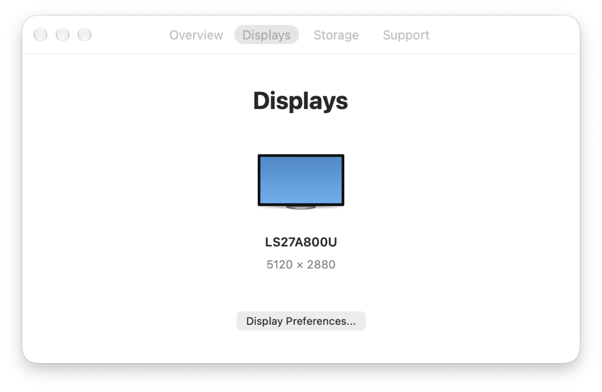
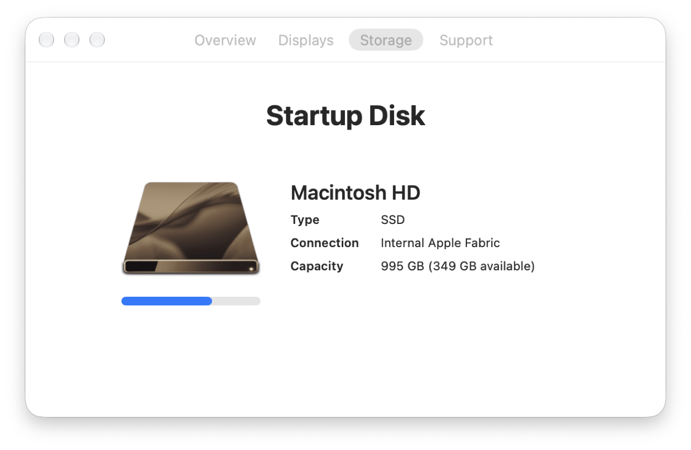
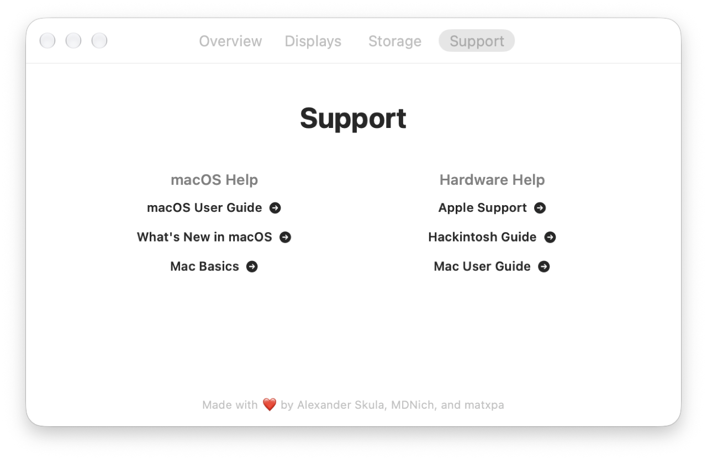
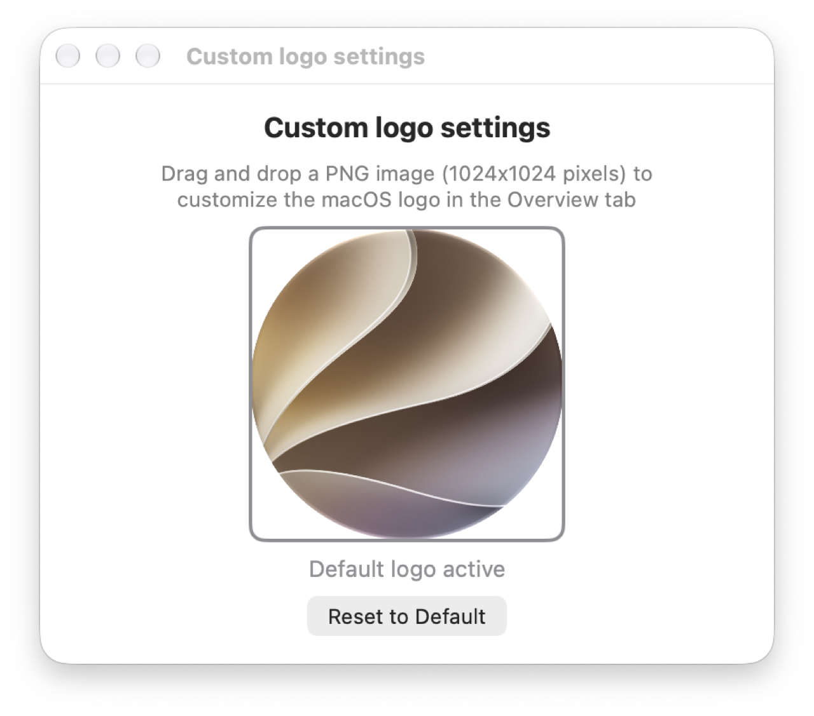

# About This Hack: Your Mac's Story, Beautifully Told


<p align="center"></p>

Discover the heart of your macOS device with About This Hack: a sleek, intuitive hardware info app that brings back the beloved classic 'About This Mac' interface while offering a treasure trove of additional features. Whether you're on a Hackintosh or a real Mac, experience the best of all worlds with About This Hack!<br>

# Key Features

## Overview (Remember this?)

A throwback to the (better) About This Mac view from before Ventura. You get your Mac model, macOS version, processor, memory, startup disk, display, graphics, serial number, and bootloader at a glance. Hackintosh users see their Clover or OpenCore version, like `OpenCore 1.0.0 (Release)`.

The window opens with data right away. Slower details like memory type load in the background and fill in a moment later.

> 💡 Pro Tip: Click your serial number to hide it for screenshots!

## Displays

See up to three connected displays with their resolutions. The tab updates when you plug in or remove a monitor.



## Storage

See your startup disk's name, type, connection, and free space, with a usage bar that turns red when the disk is over 90% full.



## Support

Access a list of support resources for both Mac and Hackintosh users.



---

Some values show more details when you hover over them. See if you can find them all! 😉

There is also a native auto-updater that tells you when a new version is out.

## Customization

### Custom Logo

Want to personalize your About This Hack? You can now replace the macOS logo in the Overview tab with your own custom image!

1. Go to **About This Hack > Preferences...** (or press ⌘,)
2. Drag and drop your custom PNG image (must be 1024x1024 pixels)
3. Your custom logo will instantly appear in the Overview tab
4. Click "Reset to Default" anytime to restore the original macOS logo

**Note:** The image must be in PNG format and exactly 1024x1024 pixels in size.



---

## Getting Started

1. Download the latest release [here](https://github.com/2009-Nissan-Cube/About-This-Hack/releases/latest)
2. Drag the app to your Applications folder
3. Launch and explore!
4. If you get [this error](https://user-images.githubusercontent.com/79278890/111886978-4af4cb80-89a8-11eb-90c8-522a89abb48e.png) when opening
- Open `System Preferences` and go to `Security & Privacy`
- You'll see a notice saying About This Hack app is blocked
- Click "Open Anyway".

## Building from Source

Open `About This Hack.xcodeproj` in Xcode and run the **About This Hack** scheme. To run the tests from the command line:

```bash
xcodebuild test -project "About This Hack.xcodeproj" -scheme "About This Hack" -destination platform=macOS
```

The tests cover processor and bootloader formatting, version comparison, matching localization keys across languages, and a quick check that each hardware collector returns a value on the current Mac.

## Compatibility

- Supports macOS 12 Monterey and newer
- Not compatible with Linux or Windows.

## Credits

A big thank you to our contributors:

[matxpa](https://github.com/matxpa) for doing so much and helping add so many features. <br>
[MDNich](https://github.com/MDNich) for helping out a ton with features, code, and setting up the update server. <br>
[LordNaut](https://github.com/Nautilus704) for helping me fix stuff with AppDelegate and sorting out a bunch of minor, but important features! <br>
[Ben216k](https://github.com/Ben216k) for being awesome, providing some of the commands, and helping me debug a lot. <br>
[Snoopy](https://macosicons.com/#/u/Squid4572) for helping create the new icon. <br>
The internet for helping me with a lot of the code.

---

## Support About This Hack

About This Hack is a labor of love, bringing back the classic Mac experience with modern enhancements. If you enjoy using it, consider supporting its development:

<p align="center">
  <a href="https://opencollective.com/about-this-hack" target="_blank">
    
  </a>
</p>

